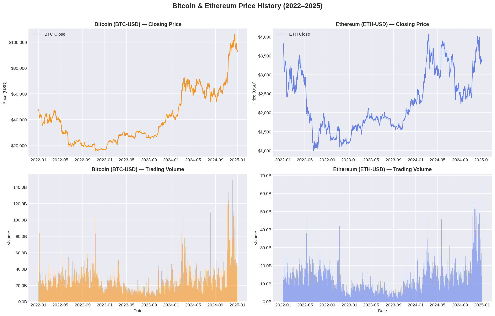
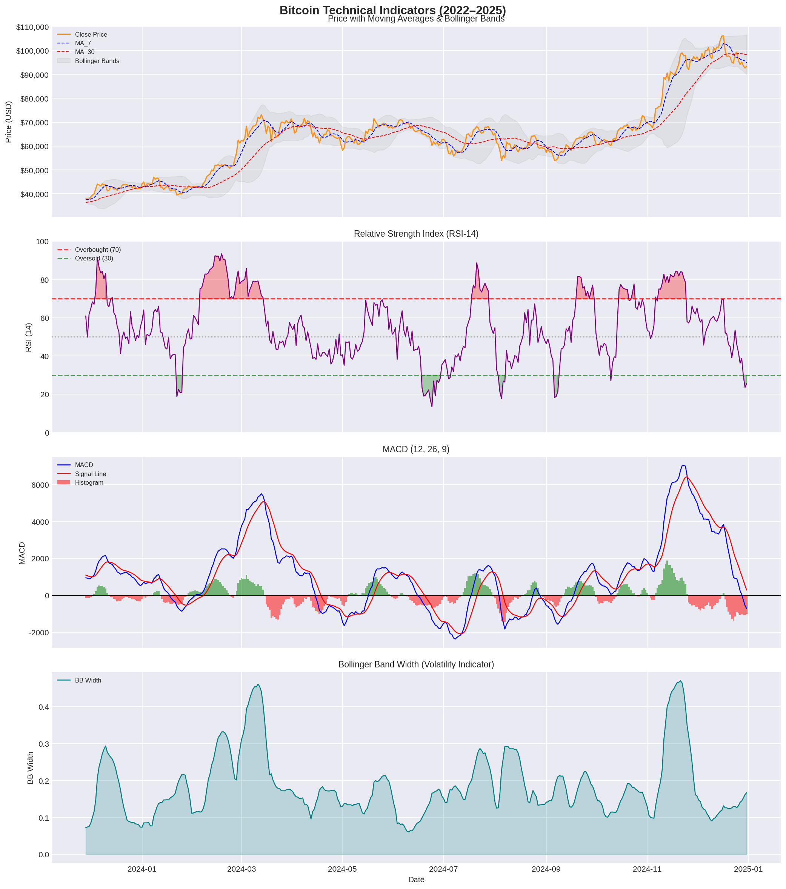
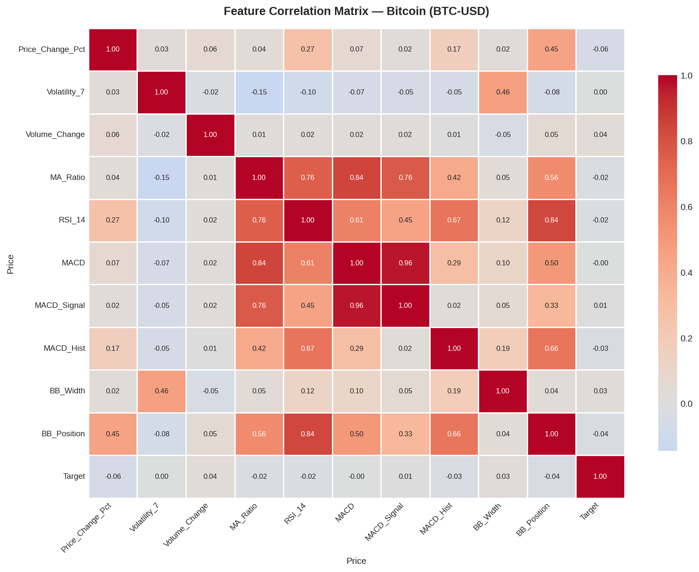
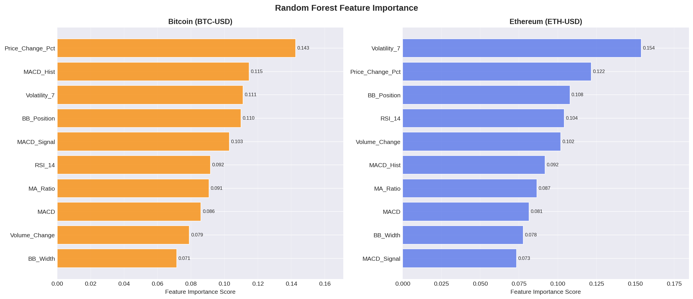
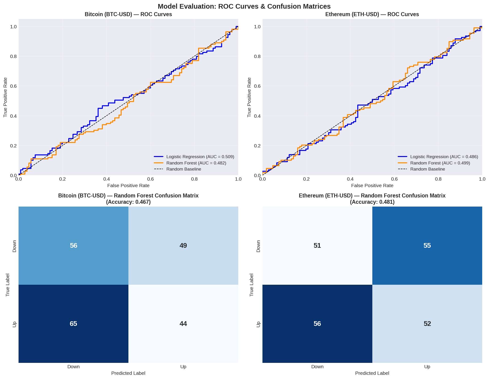

# Cryptocurrency Price Direction Prediction Using Machine Learning

> **ACC102 Mini Assignment** | Xi'an Jiaotong-Liverpool University | 2024–25

---

## Research Question & Target Audience

**Research Question:** Can machine learning models (Random Forest, Logistic Regression) predict the next-day price direction of Bitcoin (BTC) and Ethereum (ETH) using technical indicators derived from historical price data?

**Target Audience:** This project is designed for cryptocurrency investors seeking data-driven trading signals, quantitative analysts evaluating the predictability of digital asset markets, and finance students interested in applying machine learning to algorithmic trading strategies.

---

## Dataset

| Field | Details |
|-------|---------|
| **Source** | Yahoo Finance via the `yfinance` Python library |
| **Assets** | BTC-USD (Bitcoin), ETH-USD (Ethereum) |
| **Period** | 1 January 2022 – 1 January 2025 (daily OHLCV data) |
| **Accessed** | April 2026 |
| **Records** | 1,096 trading days per asset |
| **Engineered Features** | 10 technical indicators: RSI-14, MACD, MACD Signal, MACD Histogram, Bollinger Band Width, Bollinger Band Position, MA Ratio (7/30), 7-day Volatility, Price Change %, Volume Change % |
| **Target Variable** | Binary: 1 = next-day price up, 0 = next-day price down |

---

## Python Methods

All technical indicators were computed **manually using `pandas`** without relying on external TA libraries, demonstrating a clear understanding of the underlying formulas.

| Library | Role |
|---------|------|
| `yfinance` | Automated download of historical OHLCV data from Yahoo Finance |
| `pandas` | Data manipulation, feature engineering (RSI, MACD, Bollinger Bands, moving averages) |
| `numpy` | Numerical operations and target variable construction |
| `matplotlib` / `seaborn` | Data visualisation (5 figures: price history, technical indicators, correlation heatmap, feature importance, ROC curves & confusion matrices) |
| `sklearn` | Model training (`RandomForestClassifier`, `LogisticRegression`), standardisation (`StandardScaler`), and evaluation (`accuracy_score`, `roc_auc_score`, `confusion_matrix`) |

**Modelling approach:** A chronological 80/20 train/test split was used (no random shuffling) to prevent data leakage — a critical requirement for financial time-series data. Two models were compared: Logistic Regression as a linear baseline and Random Forest as a non-linear ensemble method.

---

## Key Findings

- **Both models perform near the 50% random baseline**, consistent with the Efficient Market Hypothesis: BTC Logistic Regression achieved 50.93% accuracy (AUC 0.509); Random Forest achieved 46.73% (AUC 0.482).
- **Logistic Regression outperforms Random Forest** on both assets, suggesting the relationship between technical indicators and next-day price direction is largely linear (or near-random), and ensemble complexity does not add predictive value.
- **Most predictive features** (by Random Forest importance): `Price_Change_Pct` (14.3%) and `Volatility_7` (11.1%) for BTC; `Volatility_7` (15.4%) and `Price_Change_Pct` (12.2%) for ETH — short-term momentum and volatility carry more signal than trend indicators like MACD.
- **Cryptocurrency markets are difficult to predict** using technical indicators alone, particularly across a dataset spanning both a severe bear market (2022) and a strong bull market (2024).

---

## How to Run

**Requirements:** Python 3.9+

```bash
# 1. Clone the repository
git clone https://github.com/MeiyaHan24/crypto-ml-price-prediction.git
cd crypto-ml-price-prediction

# 2. Install dependencies
pip install -r requirements.txt

# 3. Launch the notebook
jupyter notebook notebooks/crypto_ml_analysis.ipynb
```

The notebook will automatically download fresh BTC and ETH data from Yahoo Finance and reproduce all 5 figures and model results.

---

## Repository Structure

```
crypto-ml-price-prediction/
├── data/
│   └── crypto_data.csv              # Raw BTC + ETH OHLCV data (2022–2025)
├── notebooks/
│   └── crypto_ml_analysis.ipynb    # Main analysis notebook (7 sections)
├── outputs/
│   ├── fig1_price_history.png       # BTC & ETH price history with volume
│   ├── fig2_technical_indicators.png # RSI, MACD, Bollinger Bands (BTC)
│   ├── fig3_correlation_heatmap.png  # Feature correlation matrix
│   ├── fig4_feature_importance.png   # Random Forest feature importance
│   └── fig5_model_comparison.png     # ROC curves & confusion matrices
├── README.md
└── requirements.txt
```

---

## Output Visualisations

**Figure 1 — Price History**


**Figure 2 — Technical Indicators (BTC)**


**Figure 3 — Correlation Heatmap**


**Figure 4 — Feature Importance**


**Figure 5 — Model Comparison**


---

## Limitations & Future Improvements

**Current Limitations:**

1. **Technical indicators only** — The models rely exclusively on price-derived features. Cryptocurrency prices are heavily influenced by on-chain metrics (active addresses, transaction volume), social media sentiment (Twitter/Reddit Fear & Greed Index), and macroeconomic events (regulatory announcements, interest rate decisions), none of which are captured here.
2. **No transaction costs** — Real-world trading profitability is not assessed; bid-ask spreads, exchange fees, and slippage would erode any marginal edge above the 50% baseline.
3. **Market non-stationarity** — The 2022–2025 period spans a bear market, recovery, and bull run. Models trained on one regime may not generalise to another, and the statistical properties of technical indicators shift across market cycles.
4. **No hyperparameter optimisation** — Models use manually set parameters; systematic grid search or Bayesian optimisation could potentially improve performance.

**Potential Improvements:**

- Incorporate **sentiment data** (e.g., Crypto Fear & Greed Index, Twitter sentiment scores) as additional features
- Add **on-chain metrics** (e.g., active addresses, miner revenue) from sources such as Glassnode
- Explore **deep learning models** (LSTM, Transformer) to capture temporal dependencies in price sequences
- Implement **walk-forward validation** for more realistic out-of-sample performance estimation
- Extend to **intraday data** (hourly or 15-minute intervals) for higher-frequency signal analysis

---

## Author

**Meiya Han** | ACC102 Mini Assignment | XJTLU 2024–25
